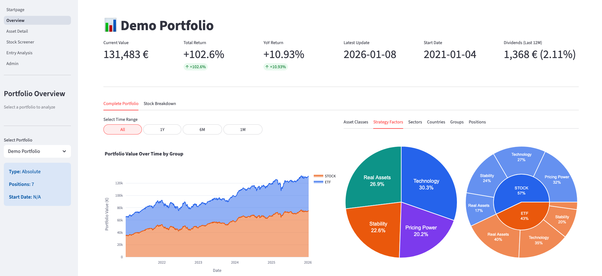
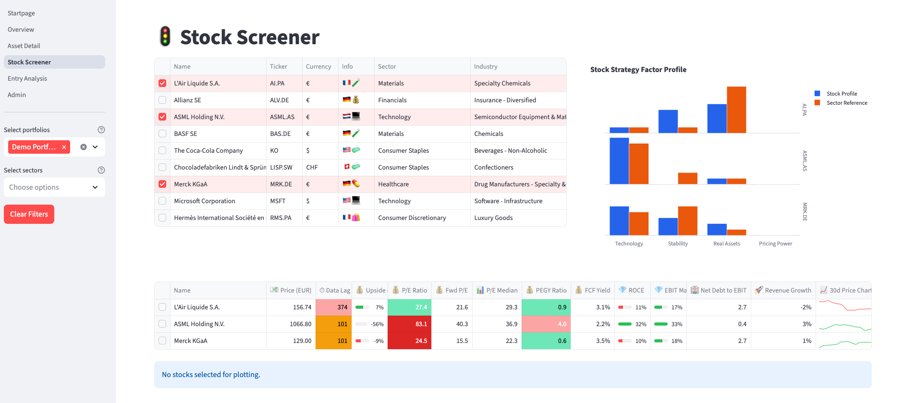

# 🛡️ Quality Core Portfolio X-Ray


> **"From Stock Tickers to Sensors."**
> An industrial-grade data analytics platform simulating high-frequency time-series processing, robust ETL pipelines, and factor-based decision support.

**Quality Core** goes beyond standard portfolio tracking. It serves as a sandbox to demonstrate **Resilient Data Science** principles: Strict schema validation, local-first architecture (Edge computing simulation), and handling data sparsity in time-series (TTM Coalescing).

---

## 📸 The Dashboard




*(Note: Please insert a screenshot or GIF of your Streamlit Admin/Overview here)*

---

## 💡 Engineering Deep Dive (Key Challenges)

This project was built to solve complex data engineering problems common in both Finance and Industrial IoT.

### 1. Robust TTM Coalescing Engine 📉
Dealing with mixed-frequency data (Quarterly Reports vs. Annual Reports vs. Daily Prices) is non-trivial.
* **The Challenge:** Calculating "Trailing Twelve Months" (TTM) metrics when data is sparse or reporting periods shift.
* **The Solution:** Implemented a **Coalescing Logic** in Polars that intelligently merges annual and quarterly data.
* **Observability:** To prevent decisions on stale data, the engine calculates and visualizes **"Data Age"**. Just like checking a sensor's heartbeat, the system flags if fundamental data is older than expected (e.g., >100 days).

### 2. Strict Schema Validation (The Gatekeeper) 🛡️
Financial APIs (`yfinance`) are notoriously unstable—fields disappear or change types.
* **Strategy:** Using **Pydantic** models as a strict anti-corruption layer.
* **Impact:** Data is validated *at ingestion*. Invalid data is rejected with clear logs before it can pollute the analytics layer (Parquet Data Lake). This mimics "Input Validation" in safety-critical industrial controls.

### 3. Custom Factor Strategy Engine 🧠
Instead of relying on black-box metrics, the core logic implements a customizable scoring system.
* **Implementation:** Flexible implementation for strategy factors for highly customizable data-inspired investment approaches.
* **Architecture:** Business logic is strictly separated from the UI logic, allowing factors to be recalculated efficiently.
* **Knowledge Base:** Knowledge about investment approaches can be easily configured and displayed on the start page to always keep the personal "investment north star" at sight.

---

## 🏗 Tech Stack & Architecture

* **Language:** Python 3.11+
* **Package Manager:** [`uv`](https://github.com/astral-sh/uv) (For deterministic builds)
* **Core Engine:** **Polars** (High-performance Dataframes)
* **Validation:** **Pydantic** (Domain Modeling)
* **Frontend:** **Streamlit** (MVC Pattern implementation)
* **Storage:** Local Parquet Data Lake (Atomic writes, "Edge-ready")

### 📂 Project Structure

A focus on Separation of Concerns (SoC) and modularity:

```text
.
├── config/                 # YAML configs (Declarative Strategy Definitions)
├── data/                   # Local Data Lake (prod/staging)
├── src/
│   ├── analysis/           # Financial Math & Metrics (Pure Functions)
│   ├── app/                # Streamlit UI (View Layer)
│   │   ├── logic/          # Controllers (Bridging UI and Core)
│   │   └── views/          # Reusable UI Components
│   ├── core/               # Domain Models (The Source of Truth)
│   ├── etl/                # Pipeline Logic (Extract -> Validate -> Load)
│   └── main.py             # CLI Entry Point
├── Makefile                # DevOps / Automation
└── pyproject.toml          # Dependency Specification

🚀 Getting Started

This project uses uv for blazing fast dependency management.
Prerequisites

    Python 3.11+

    uv (Recommended) or pip

    Make

Installation

    Clone & Sync:

Bash

git clone [https://github.com/timzen6/quality-core.git](https://github.com/timzen6/quality-core.git)
cd quality-core
uv sync  # Installs virtual env and dependencies

    Run the ETL (Hydrate Data):

Bash

make etl-full  # Fetches data, runs validation pipelines, updates Parquet lake

    Launch Dashboard:

Bash

make app

🛠 Quality Assurance

The codebase enforces strict standards to ensure maintainability (simulating a long-term industrial project lifecycle).
Bash

make qc  # Runs ruff (linting), black (formatting), and mypy (strict type checking)


## 📝 License

Distributed under the MIT License. See `LICENSE` for more information.
